# Does Environmental Performance Drive Economic Growth?

OLS regression analysis testing whether CO₂ emissions per capita and renewable energy share predict GDP growth across 38 OECD countries (2010–2020), using World Bank Sovereign ESG data.

[](https://www.python.org/)
[](https://jupyter.org/)
[](https://datacatalog.worldbank.org/search/dataset/0037651)
[](LICENSE)

---

## Results at a Glance

| Hypothesis | Test | Statistic | p-value | Decision |
|---|---|---|---|---|
| H₁: CO₂ ↔ GDP Growth | Pearson r | r = 0.0575 | 0.2405 | Fail to reject H₀ |
| H₂: Renewable % ↔ GDP Growth | Pearson r | r = −0.0485 | 0.3225 | Fail to reject H₀ |
| H₃: Overall model significance | F-test | F = 0.8775 | 0.4166 | Fail to reject H₀ |
| H₄: High vs Low Renewable GDP | Welch's t-test | t = −2.0018 | 0.0460 | **Reject H₀** ✅ |

**OLS model:** R² = 0.004, Adj. R² = −0.001 — environmental indicators alone explain less than 1% of GDP growth variance in OECD countries over this period.

---

## Dataset

| Property | Value |
|---|---|
| Source | World Bank Sovereign ESG Data Portal |
| Raw size | 16,969 rows × 68 columns (all countries, 1960–2023) |
| After filtering | 418 observations (38 OECD countries, 2010–2020) |
| Target indicators | CO₂ per capita (`EN.ATM.CO2E.PC`), Renewable % (`EG.FEC.RNEW.ZS`), GDP growth (`NY.GDP.MKTP.KD.ZG`) |

**Descriptive statistics (n = 418):**

| Variable | Mean | Std | Min | Max | Skewness |
|---|---|---|---|---|---|
| CO₂ (t/capita) | 7.44 | 3.87 | 1.38 | 21.76 | 1.14 |
| Renewable (%) | 21.98 | 16.13 | 1.30 | 82.90 | 1.50 |
| GDP Growth (%) | 1.86 | 3.16 | −10.94 | 24.62 | −0.16 |

---

## Figures

| Figure | What it shows |
|---|---|
| 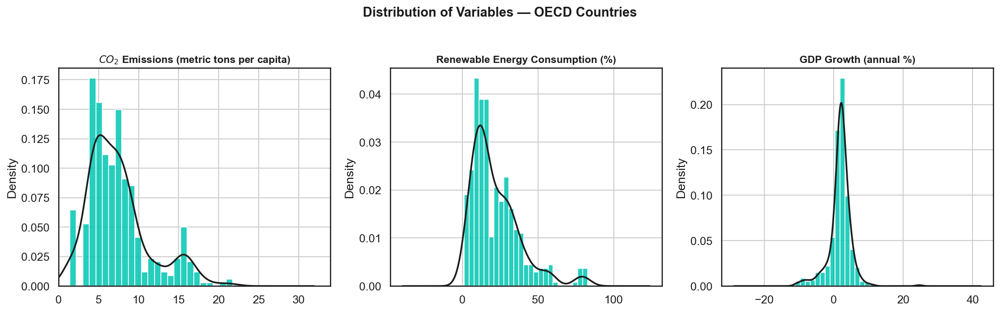 | Histograms + KDE for all three variables |
| 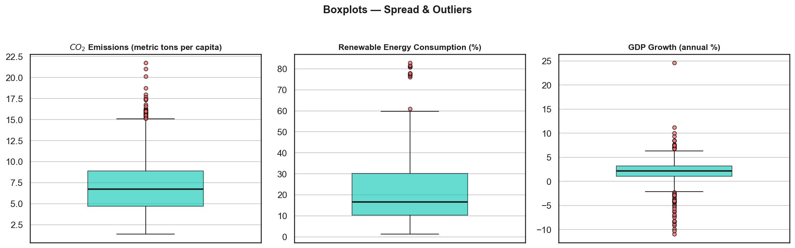 | Boxplots showing spread and outliers |
| 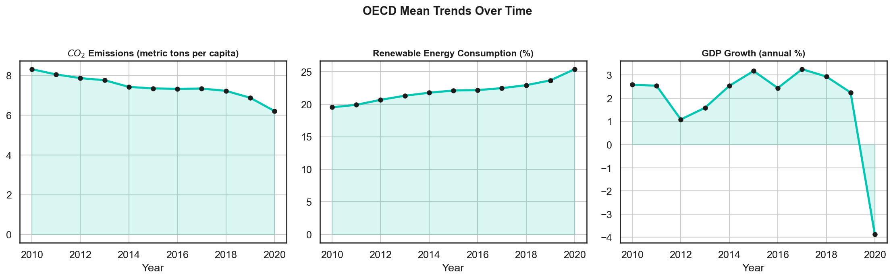 | OECD mean trends over time (2010–2020) |
| 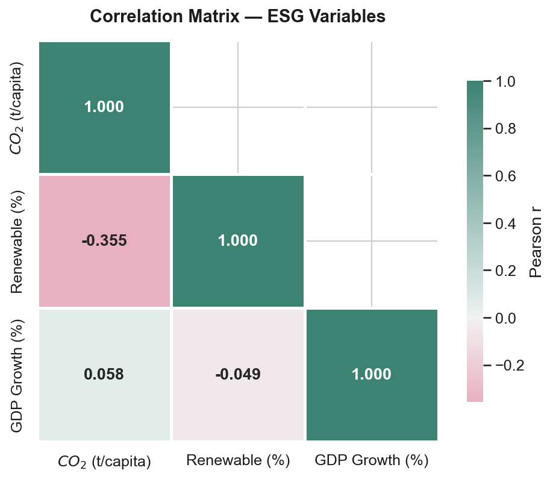 | Pearson correlation matrix heatmap |
| 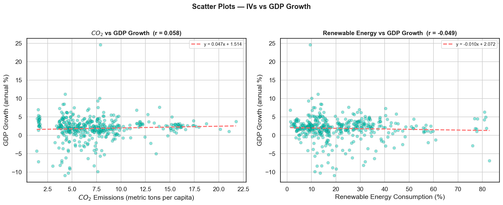 | Scatter plots: IV₁ and IV₂ vs GDP growth |
| 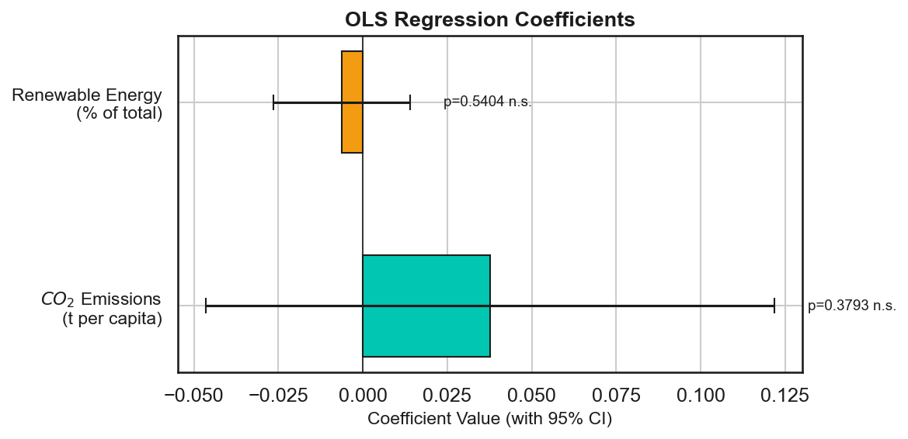 | OLS coefficient plot with 95% CIs |
| 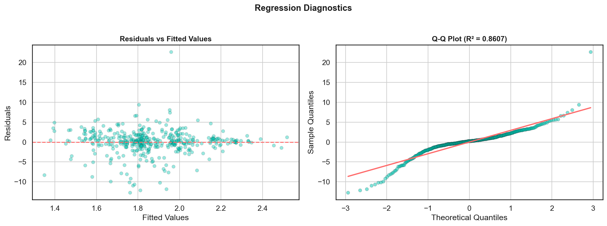 | Residuals vs fitted + Q-Q plot |
| 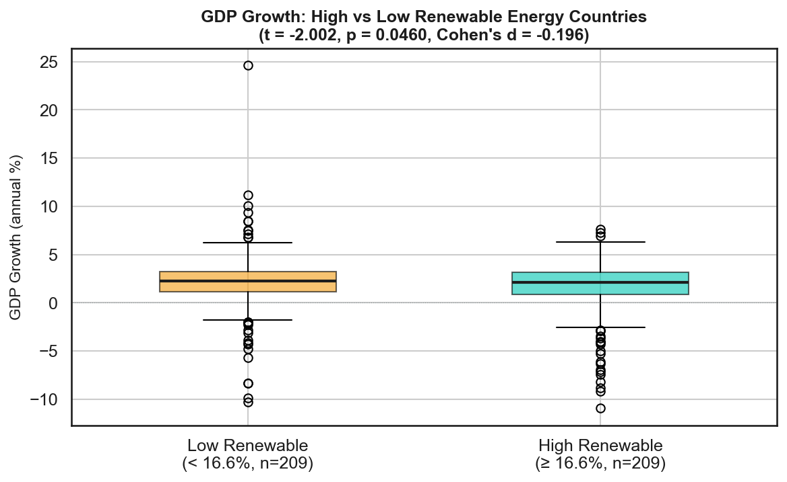 | H₄ group comparison boxplot |
| 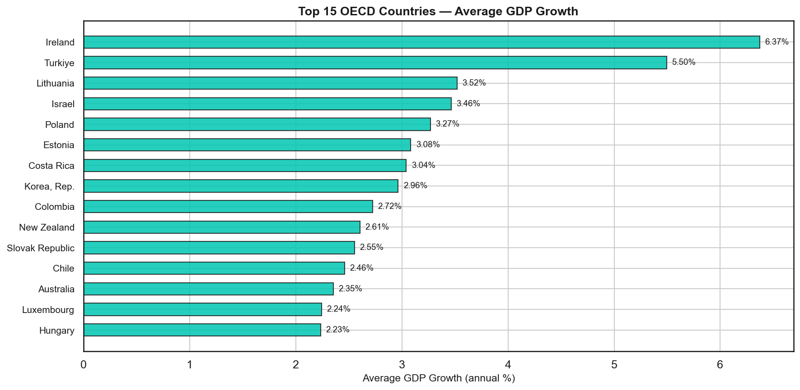 | Top 15 OECD countries by avg GDP growth |
| 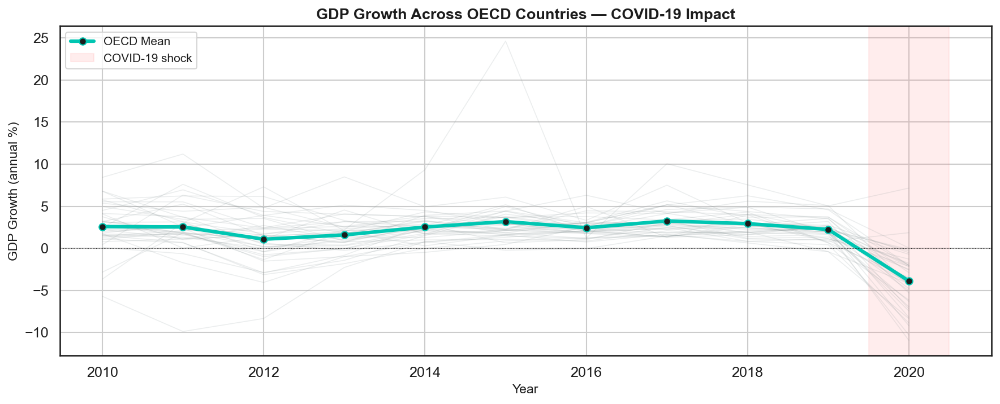 | COVID-19 shock — country trajectories 2010–2020 |

---

## Architecture

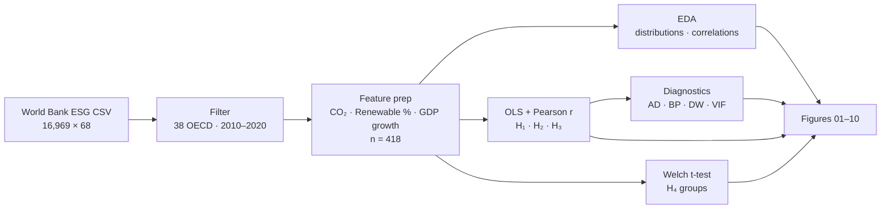

- **Ingest & filter** — the bulk World Bank CSV is narrowed to 38 OECD countries, 2010–2020.
- **Feature prep** — three indicators are aligned into a 418-row modelling frame.
- **Testing** — OLS with Pearson correlations (H₁–H₃) and a Welch t-test for the renewable-share split (H₄).
- **Diagnostics** — Anderson–Darling, Breusch–Pagan, Durbin–Watson, and VIF checks.
- **Output** — ten figures rendered to `figures/`.

## Methods

- **OLS regression** (statsmodels) with two independent variables
- **Pearson correlation** for H₁ and H₂
- **F-test** for overall model significance (H₃)
- **Welch's t-test** for group comparison (H₄)
- **Regression diagnostics:** Anderson-Darling normality test, Breusch-Pagan homoscedasticity test, Durbin-Watson autocorrelation check, VIF for multicollinearity

**Diagnostic results:**
- Normality: Anderson-Darling statistic = 14.63, p < 0.001 — residuals deviate from normality
- Homoscedasticity: Breusch-Pagan statistic = 6.70, p = 0.035 — variance not constant
- Autocorrelation: Durbin-Watson = 1.49 — possible autocorrelation
- Multicollinearity: VIF = 1.14 for both predictors — no multicollinearity concern

---

## Notable Country Findings

**Highest average GDP growth (2010–2020):**
Ireland (6.37%), Türkiye (5.50%), Lithuania (3.52%), Israel (3.46%), Poland (3.27%)

**Lowest average GDP growth:**
Greece (−2.64%), Italy (−0.60%), Spain (−0.003%), Portugal (0.01%), France (0.60%)

**COVID-19 impact:** OECD mean GDP growth dropped from 2.25% in 2019 to −3.88% in 2020.

---

## Reproduce

```bash
git clone https://github.com/kandulanikhilvarma/esg-gdp-regression.git
cd esg-gdp-regression
pip install -r requirements.txt
jupyter notebook ESG_Regression_Analysis.ipynb
```

> The notebook expects `ESGCSV.csv` in the same directory. If the file is too large for your clone, download the bulk CSV from the [World Bank ESG Data Portal](https://datacatalog.worldbank.org/search/dataset/0037651) and rename it `ESGCSV.csv`.

---

### Nikhilvarma Kandula

---

## Data & Attribution

Source data is the **World Bank Sovereign ESG Data** portal, © World Bank Group,
distributed under the [Creative Commons Attribution 4.0 (CC BY 4.0)](https://creativecommons.org/licenses/by/4.0/)
license. The World Bank does not endorse this analysis or its conclusions; the
filtering, modelling, and interpretation here are entirely my own.

Analysis code in this repository is released under the MIT License (see
[LICENSE](LICENSE)); the source data remains under its original terms.

---

## References

- Angelidis et al. (2024). World ESG performance and economic activity. *Journal of International Financial Markets, Institutions and Money*. https://doi.org/10.1016/j.intfin.2024.101986
- Dkhili, H. (2019). Environmental performance and economic growth in MENA countries. *Journal of Health and Pollution*, 9(24), 191208. https://doi.org/10.5696/2156-9614-9.24.191208
- Mirziyoyeva & Salahodjaev (2023). Renewable energy, GDP and CO₂ emissions in high-globalized countries. *Frontiers in Energy Research*, 11, 1123269. https://doi.org/10.3389/fenrg.2023.1123269
- OECD (2024). *Member Countries*. https://www.oecd.org/about/members-and-partners/
- World Bank Group (2024). *Sovereign ESG Data Portal*. https://datacatalog.worldbank.org/search/dataset/0037651

---

## License

Released under the MIT License — see [LICENSE](LICENSE).

---

**Nikhilvarma Kandula** — Data Science · NLP · Statistical Analysis  
[LinkedIn](https://www.linkedin.com/in/nikhilvarmakandula) · [Email](mailto:kandulanikhilvarma@gmail.com) · [Portfolio](https://kandula.studio)
